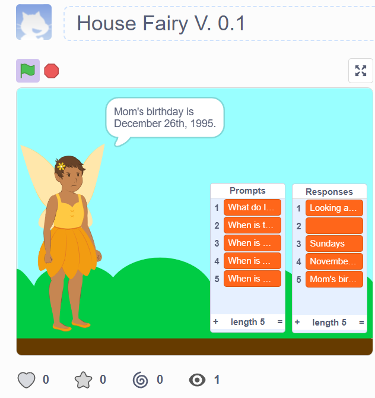

House Fairy is an early prototype of a learning household assistant built in Scratch while I study computer science through Harvard’s CS50x.
The project explores a simple idea: What if a household assistant could learn information specific to a family and recall that information during conversation?

Version: 0.1

 Platform: Scratch
 
 Project Type: Learning chatbot prototype

 
About the Project:
House Fairy is a simple chatbot that can be taught new question-and-answer pairs by the user.
If House Fairy recognizes a question, it retrieves the corresponding stored response. If it doesn’t know the answer, it asks the user to teach it. The new question and response are then added to its knowledge so they can be recognized later.
This Scratch project is the first proof of concept for a larger idea: an intelligent household assistant designed to help families organize and access information about their home and daily lives.

How It Works:
When a user asks House Fairy a question-
The program receives the user’s input.
It searches its stored questions for a match.
If a match exists, it retrieves the corresponding response.
If no match exists, House Fairy asks the user to provide an answer.
The question and new response are stored together.
House Fairy can then recognize that question during later interactions within the project session.
This creates a basic user-driven knowledge system that grows through interaction.

Features:
Interactive question-and-answer chatbot
User-taught responses
Storage and retrieval of learned information
Fallback behavior for unknown questions
Growing question-and-answer knowledge lists
Conversational interface
Household-focused chatbot concept

Why I Built It:
I built House Fairy as a hands-on learning project while studying computer science and wanted to apply the concepts I was learning to an idea that could eventually become a larger application.
The long-term House Fairy concept is a household assistant that could help families manage and access things such as:
Family schedules
Household tasks
Grocery lists
Reminders
Important household information
Family communication

House Fairy v0.1 is an early prototype used to explore the basic interaction and learning concept before attempting more advanced implementations.

What I Learned
Building and modifying this project gave me hands-on practice with:
Variables
Lists and data storage
Conditional logic
Loops
User input
Searching stored information
Connecting questions with corresponding responses
Designing fallback behavior
Debugging program behavior
Breaking a larger idea into smaller programming problems
Modifying an existing program for a different use case
Thinking about how software can store and retrieve user-provided information
I also used this project to begin practicing Git and GitHub, including repository creation, commits, project documentation, versioning, and maintaining a README.

Built With:
Scratch — visual programming and chatbot prototype
Git — version control
GitHub — project hosting and documentation

Future Development:
As my programming skills develop, I plan to explore rebuilding the House Fairy concept using traditional programming languages and a more advanced software architecture.

Potential future development includes:
Persistent user data
User accounts
Multiple household members
Family calendars
Household task management
Grocery and shopping lists
Reminders
Natural-language interaction
Web or mobile interfaces
Database integration
AI-powered features
The goal is to gradually evolve the concept from a Scratch learning prototype into a more capable household software application.

Credits & Learning Resources
The chatbot structure and core coding logic for this prototype were built by following a step-by-step YouTube tutorial on creating an AI chatbot in Scratch:
Tutorial: https://youtu.be/wP_OsxPbdXA?feature=shared
The tutorial provided the instructions and programming foundation for building the chatbot system in Scratch. I followed it as a learning exercise while developing my understanding of programming concepts.
From that foundation, I customized the project into House Fairy, including its household-assistant concept, conversational wording, user experience, and direction for future development.
Visual assets used in this prototype were provided through the Scratch asset library.
This project was created as part of my hands-on computer science learning while taking Harvard’s CS50x and practicing how to build, modify, document, and version software projects.

Project Status
House Fairy v0.1 — Early Prototype
This repository represents an early stage in my computer science learning and the starting point for the larger House Fairy concept.
Future versions may be rebuilt using other programming languages and technologies as my software engineering skills develop.
